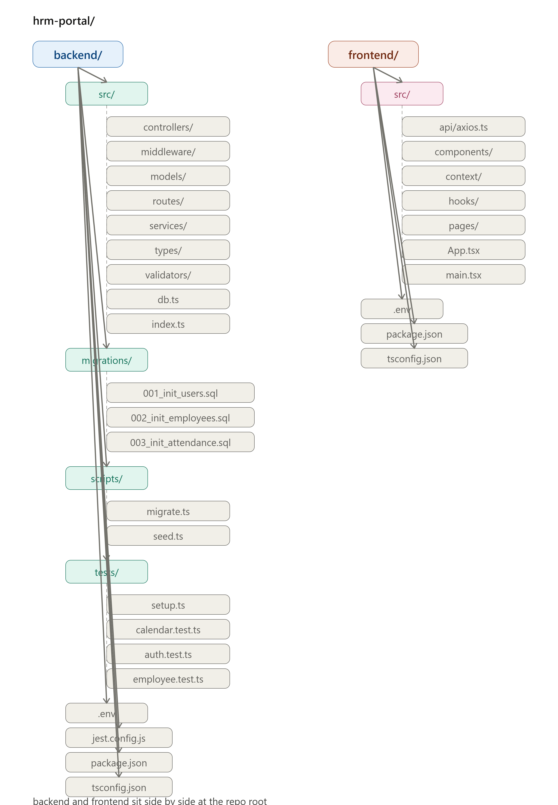

# HRM PORTAL

A Human Resource Management system: Node.js/Express/TypeScript backend
(no ORM, raw SQL via mysql2), manual MySQL migrations, custom JWT auth,
Joi validation, and a React + Tailwind frontend with a variable-cycle
attendance calendar.


## SETUP

### Prerequisites
- Node.js 18+
- MySQL running locally (XAMPP or standalone MySQL Server)

### Database
Create an empty database named `hrm_db`. No tables need to be created
manually -- migrations handle that.

### Backend
```bash
cd backend
npm install
```

Create `backend/.env`:

```env
DB_HOST=localhost
DB_USER=root
DB_PASSWORD=
DB_NAME=hrm_db
DB_PORT=3306
PORT=5000
JWT_SECRET=replace_with_a_long_random_string
JWT_EXPIRES_IN=8h
FIRST_DAY_OF_MONTH=1
```

Generate a secret:

```bash
node -e "console.log(require('crypto').randomBytes(64).toString('hex'))"
```

Run migrations:

```bash
npm run db:migrate
```

Run the seed script (creates 1 admin login + 50 fake employees + 3 months of attendance):

```bash
npm run db:seed
```

Start the server:

```bash
npm run dev
```

Login with: `admin@hrm.com` / `Admin@123`

Run tests:

```bash
npm test
```

### Frontend

```bash
cd frontend
npm install
npm run dev
```

Open http://localhost:5173


## PROJECT STRUCTURE




## APPROACH

### Migration execution logic
Migrations are numbered `.sql` files in `backend/migrations/`
(001_init_users.sql, 002_init_employees.sql, 003_init_attendance.sql).
`scripts/migrate.ts` creates a migrations tracking table, reads the
folder sorted alphabetically (so numeric prefixes enforce order), and
for each file checks if its filename is already in the tracking table.
If not, it runs the file's SQL and records the filename. This
guarantees each migration runs exactly once and that dependent tables
(e.g. attendance's foreign key to employees) are always created after
their dependency.

### Data validation
Every write endpoint validates the request body with a Joi schema
before touching the database, using `abortEarly: false` so all errors
return together as a `400` with an `errors` array. Schemas enforce types,
date formats, and business rules (`salary >= 0`, status restricted to
`Present/Absent/Leave`). Raw rows from mysql2 are never returned
directly -- each service passes them through a `mapX()` function that
casts and reshapes fields into the corresponding TypeScript interface
first.

### Custom calendar date boundaries
`FIRST_DAY_OF_MONTH` (in `.env`) redefines what a "month" cycle means,
e.g. `FIRST_DAY_OF_MONTH=21` makes "October" mean September 21 -
October 20 -- the cycle is named after the month it ends in. This is
computed by a pure function, `getCustomMonthRange(year, month, firstDay)`,
in `backend/src/services/attendanceService.ts`, covering standard months,
custom-start cycles, and December-to-January rollover. A second function,
`getCycleMonthForHireDate`, determines which cycle a new hire's start date
falls into. The frontend mirrors this same math in `CalendarGrid.tsx` and
reads `FIRST_DAY_OF_MONTH` live from `GET /config` so both stay in sync;
days before an employee's hire date render as disabled and the backend
rejects marking attendance earlier than the hire date.
